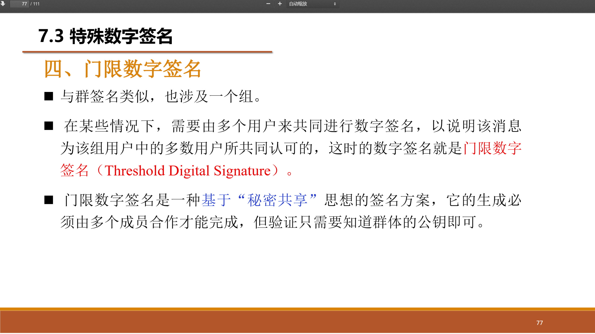
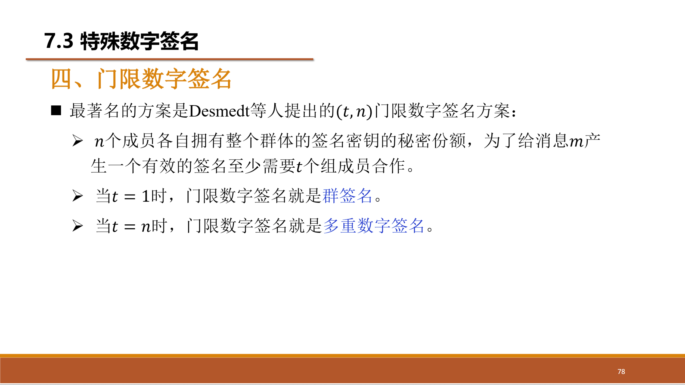
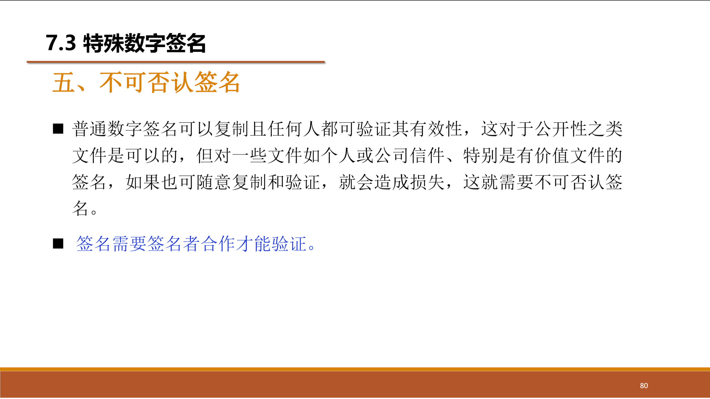

## 数字签名

|数字签名应具有的性质|
|:--:|
|签名可信|
|签名不可伪造|
|签名不可重用|
|签名文件不可改变|
|签名不可抵赖|

|数字签名两种方法|数字签名方案|
|:---:|:---:|
|对消息整体签名|直接数字签名|
|对消息摘要签名|仲裁数字签名|

### 直接数字签名
|对称体制|
|:-:|
||

|非对称体制|
|:-:|
||
||

### 仲裁数字签名
***由中间人A来进行验证和和转发，A分别与X、Y共享一个秘钥***
***Y无法直接获取到M的哈希值的***
|对称体制|
|:-:|
||
||
||
||

|对称体制_另一种版本|
|:-:|
||
||

|非对称体制|
|:-:|
||
||

### 针对数字签名的攻击
||攻击|
|:-:|
||
||
||

## 特殊数字签名
|盲签名|多重数字签名|群签名|门限数字签名|不可否认签名|一次性签名|失败-停止签名|前向安全签名|变色龙签名|同时生效签名|并发签名|代理签名
|:-:|:-:|:-:|:-:|:-:|:-:|:-:|:-:|:-:|:-:|:-:|:-:|
### 盲签名
 |盲签名|
|:-:|
||
||
||
||
||
||
||
||
||
||
### 门限数字签名
 |门限数字签名|
|:-:|
||
||
||
### 不可否认签名
 |不可否认签名|
|:-:|
||
||
||
### 一次性签名
 |一次性签名|
|:-:|
||
||

